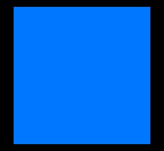

# Resizer Service
Is a service that resizes and crops images provided by url to a width and height parameters via a rest [API](#API)
* Original image \
    
* When the requested size is bigger than the original dimensions it just adds blank(black) space around the image \
    
* When the requested size does not adhere to the original image's aspect ratio it adds blank(black) space in the axis where the size ratio is bigger than the other
    * as such if you'd execute /Get ?url=imgurl&width=130&height=150 \
    and the original dimensions where 200X200 there will be a 10 pixels area above and below the image that is blank(black) \
    Get /thumbnail?url=http://www.example.com/sample.jpg&width=80&height=100 \
    


## installation
In order to build and use this project you need either a posix environment(linux/mac), if you are running windows please install [MinGw64](http://mingw-w64.org/doku.php) \
To be able locally run the service or modify it run the following lines in the terminal to install it
```bash
git clone https://github.com/sp-guip/resizer-service
cd resizer-service
./build.sh
```
***importatnt! in windows after installing, run the project in the cmd and not bash***
you are ready to go 

## usage
To run the service type
```bash
go run .
```
### API
After running the service use it in an application by http request in the following scheme: \
[Get /thumbnail?url=http://example.com/flower.png&width=number&height=number](/?url=$&width=$&height=$) \
or if you target a remote service: \
[Get http://server.hostname/thumnail?url=http://example.com/flower.png&width=number&height=number](http://server.hostname/thumnail?url=$&width=$&height=$)
